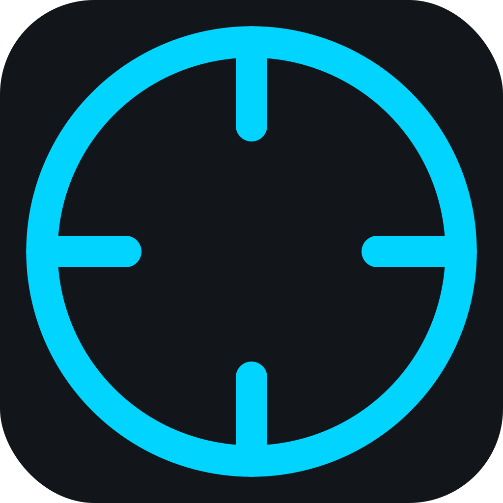

# Telescope

<p align="center">
  
</p>

<p align="center">
  <strong>EVE Online Intel Tool</strong><br>
  Instant pilot lookups with threat assessment from zKillboard
</p>

<p align="center">
  <a href="https://github.com/eve-telescope/telescope-app/releases">
    
  </a>
  <a href="https://github.com/eve-telescope/telescope-app/blob/main/LICENSE">
    
  </a>
</p>

---

## Features

- **Instant Lookup** — Paste local chat, get instant threat assessment
- **Threat Analysis** — Kill history, favorite ships, activity patterns, danger ratings
- **Share Intel** — Share scans via link, your corp mates can open results instantly
- **Global Hotkey** — Configurable shortcut to scan from clipboard anywhere
- **Offline Ready** — Data cached locally for fast repeat lookups

## Screenshots


## Installation

### macOS

Download the latest `.dmg` from [Releases](https://github.com/eve-telescope/telescope-app/releases), open it, and drag Telescope to your Applications folder.

### Windows

Download the latest `.msi` installer from [Releases](https://github.com/eve-telescope/telescope-app/releases) and run it.

### Linux

Download the latest `.AppImage` from [Releases](https://github.com/eve-telescope/telescope-app/releases):

```bash
chmod +x Telescope_*.AppImage
./Telescope_*.AppImage
```

## Usage

1. **Copy pilots** — Select pilot names in EVE's local chat and copy (Ctrl/Cmd+C)
2. **Paste & Scan** — Paste into Telescope and click "SCAN" (or use the global hotkey)
3. **Review threats** — See threat levels, kill stats, and activity patterns
4. **Share** — Click "SHARE SCAN" to copy a link your corp mates can open

### Global Hotkey

Configure a global hotkey in the app to instantly scan your clipboard from anywhere. Default: `Cmd+Shift+V` (macOS) / `Ctrl+Shift+V` (Windows/Linux)

## Development

### Prerequisites

- [Node.js](https://nodejs.org/) 18+
- [Rust](https://rustup.rs/) 1.77+
- [Tauri CLI](https://tauri.app/v1/guides/getting-started/prerequisites)

### Setup

```bash
# Clone the repository
git clone https://github.com/eve-telescope/telescope-app.git
cd telescope-app

# Install dependencies
npm install

# Run in development mode
npm run tauri dev

# Build for production
npm run tauri build
```

### Project Structure

```
telescope/
├── src/                    # Vue frontend
│   ├── components/         # Vue components
│   ├── composables/        # Vue composables
│   ├── types/              # TypeScript types
│   └── utils/              # Utility functions
├── src-tauri/              # Rust backend
│   ├── src/
│   │   ├── api/            # ESI & zKillboard API clients
│   │   ├── commands.rs     # Tauri commands
│   │   ├── intel.rs        # Intel processing logic
│   │   └── models.rs       # Data models
│   └── icons/              # App icons
└── package.json
```

## Tech Stack

- **Frontend**: Vue 3, TypeScript, Tailwind CSS
- **Backend**: Rust, Tauri 2
- **APIs**: EVE ESI, zKillboard
- **Icons**: Lucide

## Related

- [telescope-web](https://github.com/eve-telescope/telescope-web) — Web interface for sharing scans

## License

MIT © [eve-telescope](https://github.com/eve-telescope)

---

<p align="center">
  <sub>Not affiliated with CCP Games. EVE Online and all related logos are trademarks of CCP hf.</sub>
</p>
