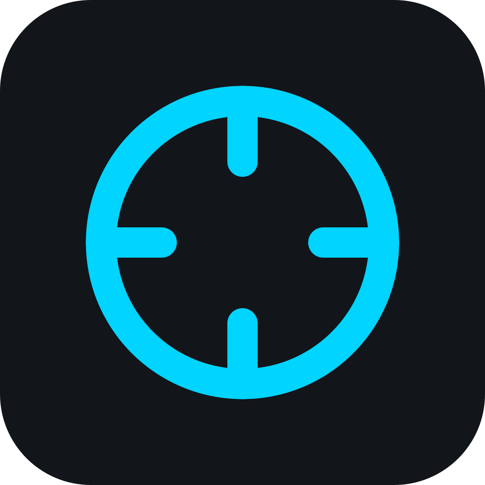

# Telescope

<p align="center">
  
</p>

<p align="center">
  <strong>EVE Online Intel Tool</strong><br>
  Instant pilot lookups with threat assessment from zKillboard
</p>

<p align="center">
  <a href="https://github.com/eve-telescope/telescope-app/releases">
    
  </a>
  <a href="https://github.com/eve-telescope/telescope-app/blob/main/LICENSE">
    
  </a>
</p>

---

## Features

- **Instant Lookup** — Paste local chat, get instant threat assessment
- **Threat Analysis** — Kill history, favorite ships, activity patterns, danger ratings
- **Share Intel** — Share scans via link, your corp mates can open results instantly
- **Global Hotkey** — Configurable shortcut to scan from clipboard anywhere
- **Offline Ready** — Data cached locally for fast repeat lookups

## Screenshots


## Installation

### macOS

Download the latest `.dmg` from [Releases](https://github.com/eve-telescope/telescope-app/releases), open it, and drag Telescope to your Applications folder.

### Windows

Download the latest `-setup.exe` installer from [Releases](https://github.com/eve-telescope/telescope-app/releases) and run it.

### Linux

Download the latest `.AppImage` from [Releases](https://github.com/eve-telescope/telescope-app/releases):

```bash
chmod +x Telescope_*.AppImage
./Telescope_*.AppImage
```

## Usage

1. **Copy pilots** — Select pilot names in EVE's local chat and copy (Ctrl/Cmd+C)
2. **Paste & Scan** — Paste into Telescope and click "SCAN" (or use the global hotkey)
3. **Review threats** — See threat levels, kill stats, and activity patterns
4. **Share** — Click "SHARE SCAN" to copy a link your corp mates can open

### Global Hotkey

Configure a global hotkey in the app to instantly scan your clipboard from anywhere. Default: `Cmd+Shift+V` (macOS) / `Ctrl+Shift+V` (Windows/Linux). On Linux the global hotkey needs an X11 session.

## Development

### Prerequisites

- [Rust](https://rustup.rs/) 1.92+
- macOS: Xcode Command Line Tools
- Windows: Visual Studio 2022 Build Tools with the C++ workload, CMake
- Linux (Ubuntu): `gcc g++ clang pkg-config libfontconfig-dev libwayland-dev libxkbcommon-x11-dev libx11-xcb-dev libssl-dev libzstd-dev libvulkan1` and a working Vulkan driver

### Setup

```bash
git clone https://github.com/eve-telescope/telescope-app.git
cd telescope-app

# Run in development mode
cargo run -p telescope-app

# Run the tests
cargo test --workspace

# Build installers for the current platform
cargo install cargo-packager --locked
cargo build --release -p telescope-app
cd crates/telescope-app && cargo packager --release
```

### Project Structure

```
telescope-app/
├── crates/
│   ├── telescope-core/     # UI-independent logic
│   │   ├── src/api/        # ESI & zKillboard clients
│   │   ├── src/domain/     # Threat, d-scan, lookup and SDE state machines
│   │   ├── src/view/       # Sorting, filtering, tags and formatting for the UI
│   │   └── src/realtime.rs # Reverb (Pusher protocol) client
│   └── telescope-app/      # GPUI desktop app
│       ├── src/state/      # Shared scan, filter, intel and settings state
│       ├── src/views/      # Panels and widgets
│       ├── src/windows/    # Main, overlay and about windows
│       └── icons/          # App icons
└── Cargo.toml
```

## Tech Stack

- **UI**: [GPUI](https://www.gpui.rs/) with [GPUI Kit](https://github.com/longbridge/gpui-kit)
- **Language**: Rust
- **APIs**: EVE ESI, zKillboard
- **Icons**: Lucide

## Related

- [telescope-web](https://github.com/eve-telescope/telescope-web) — Web interface for sharing scans

## License

MIT © [eve-telescope](https://github.com/eve-telescope)

---

<p align="center">
  <sub>Not affiliated with CCP Games. EVE Online and all related logos are trademarks of CCP hf.</sub>
</p>
