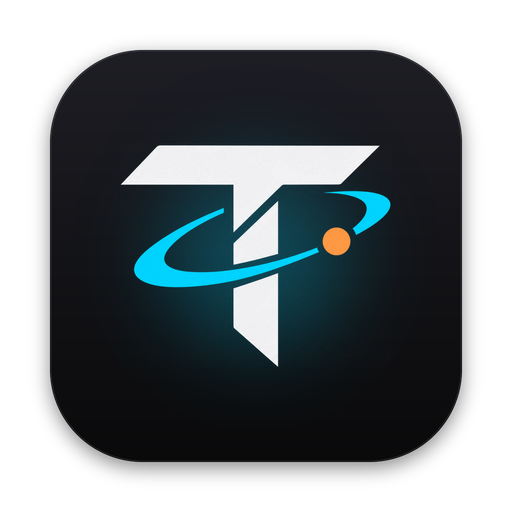
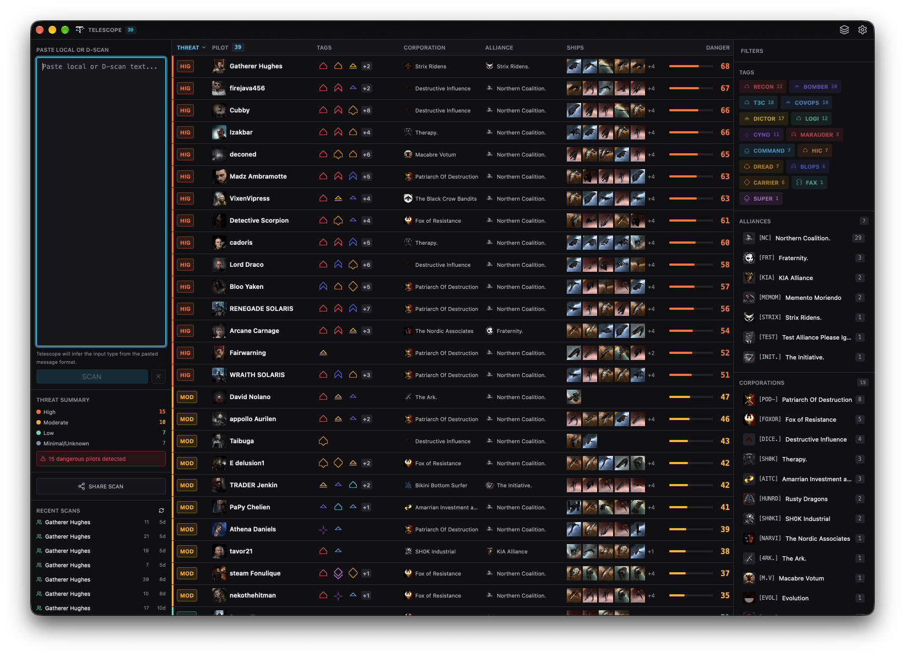

# Telescope

<p align="center">
  
</p>

<p align="center">
  <strong>EVE Online Intel Tool</strong><br>
  Instant pilot lookups with threat assessment from zKillboard
</p>

<p align="center">
  <a href="https://github.com/eve-telescope/telescope-app/releases">
    
  </a>
  <a href="https://github.com/eve-telescope/telescope-app/blob/main/LICENSE">
    
  </a>
</p>

---

## Features

- **Local scans**: paste local chat and pilots stream in as they are looked up
- **Danger score**: one 0 to 100 rating per pilot, weighted toward small-gang lethality and experience, with a breakdown on hover
- **Pilot roles**: what each pilot flies (recons, marauders, cynos, capitals and more) shown as in-game hull brackets
- **D-scan**: ship counts by type and class, sorted by hull size
- **Overlay**: a compact always-on-top window that mirrors your scan and filters
- **Intel networks**: tag pilots, corporations and alliances and share scans with your group in real time
- **Share links**: share a scan as a link your corp mates can open
- **Global hotkey**: scan the clipboard from anywhere, even while EVE has focus
- **Native and fast**: built in Rust with GPUI, with lookups cached locally

## Screenshots



## Installation

### macOS

Download the latest `.dmg` from [Releases](https://github.com/eve-telescope/telescope-app/releases), open it, and drag Telescope to your Applications folder.

### Windows

Download the latest `-setup.exe` installer from [Releases](https://github.com/eve-telescope/telescope-app/releases) and run it.

### Linux

Download the latest `.AppImage` from [Releases](https://github.com/eve-telescope/telescope-app/releases):

```bash
chmod +x Telescope_*.AppImage
./Telescope_*.AppImage
```

## Usage

1. **Copy pilots**: select pilot names in EVE's local chat (or the d-scan window) and copy with Ctrl/Cmd+C
2. **Paste and scan**: paste into Telescope and click SCAN, or use the global hotkey
3. **Review**: sort by danger, hover a score for its breakdown, click a row for ships and activity, right-click to tag
4. **Share**: click SHARE SCAN to copy a link, or connect an intel network in Settings

### Global Hotkey

Set a global hotkey in Settings to instantly scan your clipboard from anywhere. Default: `Cmd+Shift+V` (macOS) / `Ctrl+Shift+V` (Windows/Linux). On Linux the global hotkey needs an X11 session.

## Development

### Prerequisites

- [Rust](https://rustup.rs/) 1.92+
- macOS: Xcode Command Line Tools
- Windows: Visual Studio 2022 Build Tools with the C++ workload, CMake
- Linux (Ubuntu): `gcc g++ clang pkg-config libfontconfig-dev libwayland-dev libxkbcommon-x11-dev libx11-xcb-dev libssl-dev libzstd-dev libvulkan1` and a working Vulkan driver

### Setup

```bash
git clone https://github.com/eve-telescope/telescope-app.git
cd telescope-app

# Run in development mode
cargo run -p telescope-app

# Run the tests
cargo test --workspace

# Build installers for the current platform
cargo install cargo-packager --locked
cargo build --release -p telescope-app
cd crates/telescope-app && cargo packager --release
```

### Project Structure

```
telescope-app/
├── crates/
│   ├── telescope-core/     # UI-independent logic
│   │   ├── src/api/        # ESI & zKillboard clients
│   │   ├── src/domain/     # Threat, d-scan, lookup and SDE state machines
│   │   ├── src/view/       # Sorting, filtering, tags and formatting for the UI
│   │   └── src/realtime.rs # Reverb (Pusher protocol) client
│   └── telescope-app/      # GPUI desktop app
│       ├── src/state/      # Shared scan, filter, intel and settings state
│       ├── src/views/      # Panels and widgets
│       ├── src/windows/    # Main, overlay, settings and about windows
│       └── icons/          # App icons
└── Cargo.toml
```

### Releasing

1. Bump `version` in the root `Cargo.toml` and merge it into `main`
2. Push `main` to the `release` branch: `git push origin main:release`
3. The Release workflow builds the installers for macOS, Windows and Linux and uploads them to a draft release
4. Review the draft on GitHub and publish it. Installed apps pick up the new version on their next update check

## Tech Stack

- **UI**: [GPUI](https://www.gpui.rs/) with [GPUI Kit](https://github.com/longbridge/gpui-kit)
- **Language**: Rust
- **APIs**: EVE ESI, zKillboard
- **Icons**: Lucide

## Related

- [telescope-web](https://github.com/eve-telescope/telescope-web): web interface for sharing scans

## License

MIT © [eve-telescope](https://github.com/eve-telescope)

---

<p align="center">
  <sub>Not affiliated with CCP Games. EVE Online and all related logos are trademarks of CCP hf.</sub>
</p>
